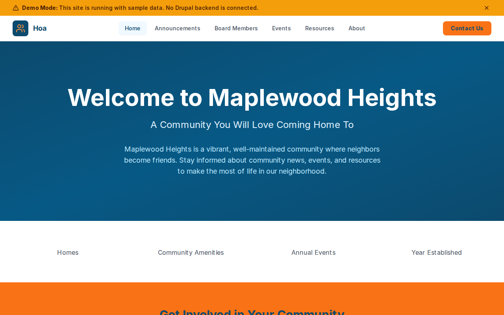

# Decoupled HOA

A homeowners association website starter template for Decoupled Drupal + Next.js. Built for HOAs, neighborhood associations, condo boards, and residential communities.



## Features

- **Announcements** - Community notices with priority levels, categories, and dates for pool openings, maintenance schedules, and board meetings
- **Board Members** - Board member profiles with position, contact info, term expiration, and photos
- **Community Events** - Neighborhood events with RSVP tracking, locations, dates, and times for block parties, cleanups, and movie nights
- **Resources** - HOA documents, guides, and references such as architectural guidelines, amenity info, and new resident welcome packets
- **Modern Design** - Clean, accessible UI optimized for community association content

## Quick Start

### 1. Clone the template

```bash
npx degit nextagencyio/decoupled-hoa my-hoa
cd my-hoa
npm install
```

### 2. Run interactive setup

```bash
npm run setup
```

This interactive script will:
- Authenticate with Decoupled.io (opens browser)
- Create a new Drupal space
- Wait for provisioning (~90 seconds)
- Configure your `.env.local` file
- Import sample content

### 3. Start development

```bash
npm run dev
```

Visit [http://localhost:3000](http://localhost:3000)

---

## Manual Setup

If you prefer to run each step manually:

<details>
<summary>Click to expand manual setup steps</summary>

### Authenticate with Decoupled.io

```bash
npx decoupled-cli@latest auth login
```

### Create a Drupal space

```bash
npx decoupled-cli@latest spaces create "My HOA"
```

Note the space ID returned. Wait ~90 seconds for provisioning.

### Configure environment

```bash
npx decoupled-cli@latest spaces env 1234 --write .env.local
```

### Import content

```bash
npm run setup-content
```

This imports:
- Homepage with hero, stats (342 homes, 6 community amenities, 20+ annual events, established 2003), and community involvement CTA
- 3 announcements: Pool Season Opens Memorial Day Weekend, Spring Landscaping and Maintenance Schedule, Annual Homeowners Meeting - April 15
- 3 board members: Janet Morrison (President), Robert Kim (Vice President), Priya Nair (Treasurer)
- 3 community events: Summer Block Party, Spring Community Cleanup Day, Outdoor Movie Night
- 3 resources: Architectural Guidelines, Community Amenities Guide, New Resident Welcome Guide
- 2 static pages: About Maplewood Heights HOA, Contact Us

</details>

## Content Types

### Announcement
- **announcement_date**: Date the announcement was published
- **priority**: Priority level (Normal, High)
- **category**: Category label (Amenities, Maintenance, Board Business)
- **image**: Featured image for the announcement

### Board Member
- **position_title**: Board position (President, Vice President, Treasurer)
- **email**: Contact email address
- **term_expires**: When the board member's term ends
- **photo**: Profile photo

### Community Event
- **event_date**: Event start date and time
- **end_date**: Event end date and time
- **location**: Event venue or meeting point
- **rsvp_required**: Whether RSVP is required
- **image**: Event image

### Resource
- **resource_category**: Category (Governance, Amenities, Getting Started)
- **last_updated**: Date the resource was last revised
- **image**: Featured image

### Homepage
- **hero_title**: Main headline (e.g., "Welcome to Maplewood Heights")
- **hero_subtitle**: Tagline (e.g., "A Community You Will Love Coming Home To")
- **hero_description**: Introductory paragraph
- **stats_items**: Key statistics (homes, amenities, events, year established)
- **featured_items_title**: Section heading for latest announcements
- **cta_title / cta_description**: Community involvement call-to-action

### Basic Page
- General-purpose static content pages (About, Contact, etc.)

## Customization

### Colors & Branding
Edit `tailwind.config.js` to customize colors, fonts, and spacing.

### Content Structure
Modify `data/hoa-content.json` to add or change content types and sample content.

### Components
React components are in `app/components/`. Update them to match your design needs.

## Demo Mode

Demo mode allows you to showcase the application without connecting to a Drupal backend.

### Enable Demo Mode

```bash
NEXT_PUBLIC_DEMO_MODE=true
```

### Removing Demo Mode

1. Delete `lib/demo-mode.ts`
2. Delete `data/mock/` directory
3. Delete `app/components/DemoModeBanner.tsx`
4. Remove `DemoModeBanner` from `app/layout.tsx`
5. Remove demo mode checks from `app/api/graphql/route.ts`

## Deployment

### Vercel (Recommended)
[](https://vercel.com/new/clone?repository-url=https://github.com/nextagencyio/decoupled-hoa)

### Other Platforms
Works with any Node.js hosting platform that supports Next.js.

## Documentation

- [Decoupled.io Docs](https://www.decoupled.io/docs)
- [Next.js Documentation](https://nextjs.org/docs)
- [Drupal GraphQL](https://www.decoupled.io/docs/graphql)

## License

MIT
